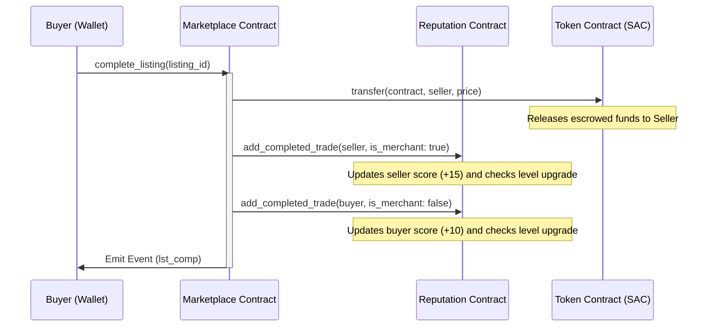

# PeerPort - Decentralized P2P Marketplace on Stellar

PeerPort is a production-ready, peer-to-peer decentralized escrow marketplace built on the Stellar network using Soroban smart contracts. It features secure trade locking, Role-Based Access Control (RBAC), automatic storage TTL extensions, and an inter-contract reputation engine that rates traders based on their completed on-chain activity.

---

## 1. Product Overview & Problem Statement

### The Problem
Traditional online peer-to-peer marketplaces rely on centralized intermediaries to handle disputes and escrow custody. These intermediaries charge high transaction fees (3-10%), introduce settlement latencies of up to several days, and have a single point of failure. Furthermore, merchant trust is siloed within individual platforms, making it impossible for a seller to carry their reputation across the web.

### The Solution: PeerPort
PeerPort solves these problems by providing:
- **Zero-Fee Escrow Custody**: Transactions are locked securely in audited Rust-based Soroban smart contract escrows. Funds are released automatically when delivery conditions are met.
- **Instant Settlement**: Settles in under 5 seconds with negligible gas costs.
- **Portable Decentralized Reputation**: Completed trades automatically increase user reputation scores and level up profiles on-chain via contract-to-contract calls.

---

## 2. Architecture & Design

### Technical Architecture


### Inter-Contract Communication Flow

When a buyer confirms delivery, the Marketplace contract releases the escrowed funds to the seller, and triggers a contract-to-contract call to the Reputation contract to reward both the buyer and seller.



### Smart Contract Design & State Transitions

#### 1. Marketplace Contract State Machine
Active listings are kept in `Persistent` storage (to prevent ledger expiration) and follow a strict linear transition lifecycle:

```
[1: Open]  ======(buyer calls buy_listing)======>  [2: Locked/Paid]
    |                                                   |
(seller cancels)                                  (buyer confirms delivery)
    |                                                   |
    v                                                   v
[4: Cancelled]                                     [3: Completed]
```

#### 2. Storage Strategy
- **Instance Storage**: Used for configuration details (Admin address, token SAC contract address, reputation contract address, and listing counter) to avoid multiple lookups.
- **Persistent Storage**: Used for user reputations and listing details. This prevents state loss and utilizes automated TTL extensions using `extend_ttl()` to maintain permanent ledger occupancy.

---

## 3. Features & Tech Stack

- **Smart Contracts (Rust & Soroban)**: Custom storage keys, RBAC validation (Admin, Merchant, Buyer), safe state transitions, and contract WASM upgrades.
- **Frontend (Next.js 15, TypeScript, Tailwind CSS)**: Dark glassmorphic design, mobile responsive grid, responsive charts for sales analytics.
- **State Management (Zustand & React Query)**: Clean separate layers for transaction caching, listings state, and wallet parameters.
- **Wallet Connection (StellarWalletsKit)**: Freighter, Albedo, and xBull support with persistence, automatic account switching, and error handling.
- **Observability (Logging & Event Streams)**: Custom logging wrapper, transaction trackers, and real-time Soroban RPC event polling.

---

## 4. Local Development & Installation

### Prerequisites
- Node.js >= 18.0.0
- Rust & Cargo toolchains
- Stellar CLI installed (see: `https://developers.stellar.org/docs/tools/cli`)

### Setup Instructions
1. **Clone the Repository:**
   ```bash
   git clone https://github.com/decoder-dd/PeerPort.git
   cd PeerPort
   ```
2. **Install Frontend Dependencies:**
   ```bash
   cd frontend
   npm install --legacy-peer-deps
   ```
3. **Rust Contract Setup:**
   Verify Cargo workspace configuration and run smart contract tests:
   ```bash
   cargo test --target-dir .cargo_target
   ```

### Running the Frontend
Start the local development server:
   ```bash
   npm run dev
   ```
Navigate to `http://localhost:3000` to view the Dapp.

---

## 5. Deployment Instructions

### Local Sandbox Deployment
1. Start your local Stellar Sandbox node.
2. Ensure you have the `alice` keypair configured in your Stellar CLI.
3. Run the local deployment script:
   ```powershell
   ./scripts/deploy-local.ps1
   ```

### Stellar Testnet Deployment
1. Generate/fund a testnet account using the Stellar CLI:
   ```bash
   stellar keys generate --global deployer --network testnet
   ```
2. Run the testnet deployment script:
   ```powershell
   ./scripts/deploy-testnet.ps1
   ```
This script will build, optimize, deploy, initialize both contracts, and automatically update `frontend/.env.local`.

---

## 6. Testing Guide

### Smart Contract Tests
Run Rust tests from the workspace root:
```bash
cargo test --target-dir .cargo_target
```

### Frontend Tests
Run Vitest tests from the `frontend/` directory:
```bash
npm run test
```

### Integration Simulation Test
Run the end-to-end transaction simulator script:
```bash
$env:NODE_PATH="d:\PeerPort\frontend\node_modules"; node scripts/integration-test.js
```

---

## 7. Security Considerations

- **Authorization Enforcement**: Every state-modifying function enforces authorization signatures using `address.require_auth()`.
- **Inter-Contract Verification**: The Reputation contract verifies that the caller matches the authorized marketplace contract using a stored configuration.
- **Ledger TTL Extension**: Listing and reputation storage structures invoke `.extend_ttl()` to extend ledger lifespan and prevent archival.
- **Safe Escrows**: Escrow funds are managed using the verified Stellar Asset Contract (SAC) token code, preventing custom token transfer vulnerabilities.

---

## 8. Deployment Registry

Once you deploy your contracts using the scripts, update these variables with your actual live addresses and hashes:

| Contract / TX | Address / Hash | Explorer Link |
| --- | --- | --- |
| **Marketplace Contract** | `CD6XK72MNLSXCZLF5FAHL2GPULI3VPV5N5H5G5OO3Q5OMEACUYOCUZSR` | [View on StellarExpert](https://stellar.expert/explorer/testnet/contract/CD6XK72MNLSXCZLF5FAHL2GPULI3VPV5N5H5G5OO3Q5OMEACUYOCUZSR) |
| **Reputation Contract** | `CBXP7YTCD4AR4EXWPNTAGOHXOIXES636Y3ZLEIMY4GUTF56XWHLXBQOR` | [View on StellarExpert](https://stellar.expert/explorer/testnet/contract/CBXP7YTCD4AR4EXWPNTAGOHXOIXES636Y3ZLEIMY4GUTF56XWHLXBQOR) |
| **Sample Escrow TX Hash** | `bcb8c7d453c7fc0d671305909562ba3649bd1346f582a6e58350742a6c8a200f` | [View on StellarExpert](https://stellar.expert/explorer/testnet/tx/bcb8c7d453c7fc0d671305909562ba3649bd1346f582a6e58350742a6c8a200f) |
