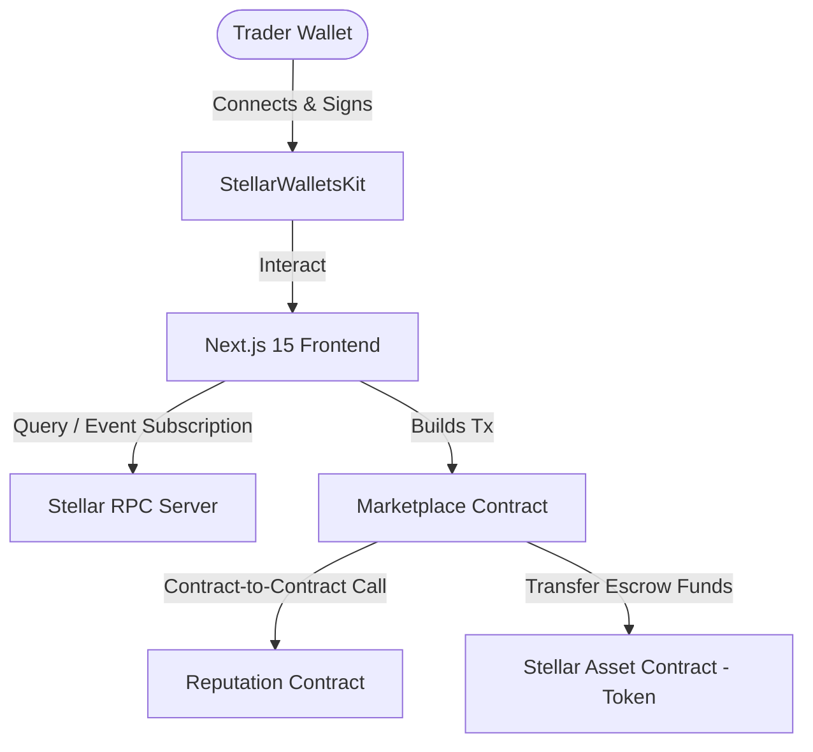
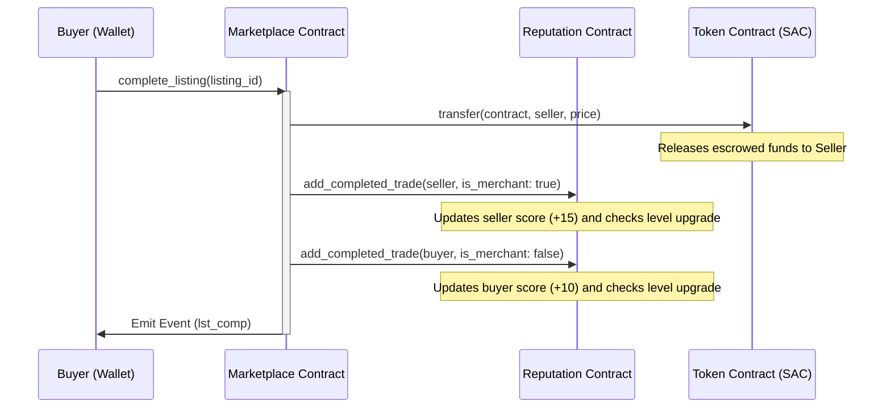

<h1 align="center">⚓ PeerPort Escrow 🔗</h1>

<p align="center">
  <strong>A Decentralized P2P Escrow Marketplace and Reputation Engine built on the Stellar network using Soroban smart contracts.</strong>
</p>

<p align="center">
  <a href="https://peer-port-eight.vercel.app/" target="_blank">
    
  </a>
</p>

<p align="center">
  <a href="https://github.com/decoder-dd/PeerPort/actions/workflows/ci.yml" target="_blank">
    
  </a>
</p>

<p align="center">
  <a href="#overview">Overview</a> •
  <a href="#tech-stack">Tech Stack</a> •
  <a href="#directory-structure">Directory Structure</a> •
  <a href="#architecture">Architecture</a> •
  <a href="#development">Development</a> •
  <a href="#deployment-guide">Deployment Guide</a> •
  <a href="#screenshots">Screenshots</a>
</p>

---

* **GitHub Repository:** [decoder-dd/PeerPort](https://github.com/decoder-dd/PeerPort)
* **Walkthrough Demo Video:** 
<!-- Video Placeholder -->
*(Add demo video link here)*

---

## 📌 Table of Contents

* [1. Product Overview & Problem Statement](#overview)
  * [The Problem](#the-problem)
  * [The PeerPort Solution](#the-peerport-solution)
* [2. Technical Stack](#tech-stack)
* [3. Directory Structure](#directory-structure)
* [4. Technical Architecture & Component Flow](#architecture)
  * [1. System Component Architecture](#component-architecture)
  * [2. Escrow Listing Lifecycle State Transitions](#state-transitions)
  * [3. Inter-Contract Communication Flow](#communication-flow)
* [5. Smart Contract Design](#contract-design)
  * [Data Storage & TTL Preservation](#ttl-preservation)
  * [Access Control](#access-control)
* [6. Local Development & Testing](#development)
  * [Prerequisites](#prerequisites)
  * [Compilation & Testing](#compilation-testing)
  * [Frontend Development](#frontend-dev)
* [7. Stellar Testnet Deployment Guide](#deployment-guide)
  * [Step 1: Configure Deployer Identity](#deployer-identity)
  * [Step 2: Compile WASM Bytecodes](#compile-wasm)
  * [Step 3: Install Bytecodes to Testnet](#install-bytecodes)
  * [Step 4: Deploy the Reputation Contract](#deploy-reputation)
  * [Step 5: Deploy the Marketplace Contract](#deploy-marketplace)
  * [Step 6: Initialize the Contracts](#initialize-contracts)
  * [Step 7: Configure Frontend](#configure-frontend)
* [8. Escrow Configuration Log & Verification](#verification)
  * [On-Chain Contract Verification Links](#verification-links)
* [9. Security Considerations](#security)
* [10. Project Media & Screenshots](#screenshots)

---

<a name="overview"></a>
## 🔍 1. Product Overview & Problem Statement

<a name="the-problem"></a>
### The Problem
Traditional online peer-to-peer marketplaces rely on centralized intermediaries to handle disputes and escrow custody. These intermediaries charge high transaction fees (3-10%), introduce settlement latencies of up to several days, and represent a single point of failure. Furthermore, merchant trust is siloed within individual platforms, making it impossible for a seller to carry their reputation across the web.

<a name="the-peerport-solution"></a>
### The PeerPort Solution
PeerPort solves these problems by providing:
* **Zero-Fee Escrow Custody**: Transactions are locked securely in audited Rust-based Soroban smart contract escrows. Funds are released automatically when delivery conditions are met.
* **Instant Settlement**: Settles in under 5 seconds with negligible gas costs on the Stellar network.
* **Portable Decentralized Reputation**: Completed trades automatically increase user reputation scores and level up profiles on-chain via contract-to-contract (C2C) calls.

---

<a name="tech-stack"></a>
## 🛠️ 2. Technical Stack

* **Smart Contracts:** Rust, Soroban SDK
* **Frontend:** Next.js 15 (App Router), TypeScript, Tailwind CSS, lucide-react
* **State Management:** Zustand (wallet session persistence, transaction center logs)
* **Data Querying:** React Query (RPC state synchronization)
* **Wallet Connection:** StellarWalletsKit SDK (Freighter / Albedo / xBull)
* **Charts & Data Visuals:** Recharts
* **Tailwind CSS & custom Web3 styling:** Dark glassmorphic design, mobile responsive grid, responsive charts for sales analytics.

---

<a name="directory-structure"></a>
## 📂 3. Directory Structure

The project is organized with a feature-based architecture separating smart contracts, deployment tools, and the Next.js frontend app:

```
PeerPort/
├── .github/
│   └── workflows/
│       └── ci.yml                # CI/CD Pipeline Configuration
├── contracts/
│   ├── marketplace/
│   │   ├── src/
│   │   │   ├── lib.rs            # Marketplace Escrow contract logic
│   │   │   ├── storage.rs        # Persistent storage helper functions
│   │   │   └── test.rs           # Marketplace escrow unit tests
│   │   └── Cargo.toml            # Marketplace contract config
│   ├── reputation/
│   │   ├── src/
│   │   │   ├── lib.rs            # Trader reputation contract logic
│   │   │   ├── storage.rs        # Reputation storage structure & keys
│   │   │   └── test.rs           # Reputation engine unit tests
│   │   └── Cargo.toml            # Reputation contract config
│   └── optimized/
│       ├── peerport_marketplace.wasm  # Optimized production build
│       └── peerport_reputation.wasm   # Optimized reputation build
├── frontend/
│   ├── src/
│   │   ├── app/
│   │   │   ├── analytics/        # Recharts interactive sales metrics
│   │   │   ├── dashboard/        # Active list, creation & user details
│   │   │   ├── feed/             # Live network event activity feed
│   │   │   ├── settings/         # RPC and network setup options
│   │   │   ├── transfer/         # Funds transfer utilities
│   │   │   ├── tx-center/        # Wallet transaction activity hub
│   │   │   ├── globals.css       # Tailwind CSS v4 styling configurations
│   │   │   ├── layout.tsx        # App layout and Google font setup
│   │   │   └── page.tsx          # Marketing home page
│   │   ├── components/
│   │   │   ├── ActivityFeed.tsx  # Interactive base64 XDR events polling feed
│   │   │   ├── ListingCard.tsx   # Escrow details card & locking logic
│   │   │   └── Navbar.tsx        # StellarWalletsKit wallet connector
│   │   ├── hooks/
│   │   │   ├── useContractEvents.ts # Real-time event polling hook
│   │   │   ├── useMarketplace.ts # Marketplace interaction hooks
│   │   │   └── useStellarWallet.ts # Wallet interaction hooks
│   │   ├── services/
│   │   │   ├── rpc.ts            # Soroban RPC client services
│   │   │   ├── tracking.ts       # Event monitoring logs
│   │   │   └── wallet.ts         # StellarWalletsKit SDK configurations
│   │   ├── state/
│   │   │   ├── useListingStore.ts # React listings cache state
│   │   │   ├── useTxStore.ts     # Transaction center state store
│   │   │   └── useWalletStore.ts # Zustand global wallet session store
│   │   └── tests/
│   │       └── frontend.test.tsx # React and Zustand unit tests
│   ├── package.json              # Frontend node packages
│   └── tsconfig.json             # TypeScript settings
└── scripts/
    ├── deploy-local.ps1          # PowerShell deployment for sandbox
    ├── deploy-testnet.ps1        # PowerShell automated deployment pipeline
    └── integration-test.js       # E2E transaction integration simulation
```

---

<a name="architecture"></a>
## 📐 4. Technical Architecture & Component Flow

<a name="component-architecture"></a>
### 1. System Component Architecture



<a name="state-transitions"></a>
### 2. Escrow Listing Lifecycle State Transitions

Active listings are kept in `Persistent` storage (to prevent ledger expiration) and follow a strict linear transition lifecycle:

```
[1: Open]  ======(buyer calls buy_listing)======>  [2: Locked/Paid]
    |                                                   |
(seller cancels)                                  (buyer confirms delivery)
    |                                                   |
    v                                                   v
[4: Cancelled]                                     [3: Completed]
```

<a name="communication-flow"></a>
### 3. Inter-Contract Communication Flow

When a buyer confirms delivery, the Marketplace contract releases the escrowed funds to the seller, and triggers a contract-to-contract call to the Reputation contract to reward both the buyer and seller.



---

<a name="contract-design"></a>
## 📝 5. Smart Contract Design

<a name="ttl-preservation"></a>
### Data Storage & TTL Preservation
* **Instance Storage**: Used for configuration details (Admin address, token SAC contract address, reputation contract address, and listing counter) to avoid multiple lookups.
* **Persistent Storage**: Used for user reputations and listing details. This prevents state loss and utilizes automated TTL extensions using `extend_ttl()` to maintain permanent ledger occupancy and avoid state archival.

<a name="access-control"></a>
### Access Control
* **Authorization Enforcement**: Every state-modifying function enforces authorization signatures using `address.require_auth()`.
* **Inter-Contract Verification**: The Reputation contract verifies that the caller matches the authorized marketplace contract using a stored configuration.

---

<a name="development"></a>
## 💻 6. Local Development & Testing

<a name="prerequisites"></a>
### Prerequisites
* Rust & Cargo toolchains
* Node.js >= 18.0.0
* Stellar CLI installed (see: `https://developers.stellar.org/docs/tools/cli`)

<a name="compilation-testing"></a>
### Compilation & Testing
1. **Run Smart Contract Unit Tests**:
   ```bash
   cargo test --target-dir .cargo_target
   ```
2. **Run End-to-End Simulation Test**:
   ```bash
   $env:NODE_PATH="d:\PeerPort\frontend\node_modules"; node scripts/integration-test.js
   ```

<a name="frontend-dev"></a>
### Frontend Development
1. **Install Dependencies**:
   ```bash
   cd frontend
   npm install --legacy-peer-deps
   ```
2. **Run Frontend Unit Tests**:
   ```bash
   npm run test
   ```
3. **Start Development Server**:
   ```bash
   npm run dev
   ```
   Open `http://localhost:3000` to interact with the interface.

---

<a name="deployment-guide"></a>
## 🚀 7. Stellar Testnet Deployment Guide

<a name="deployer-identity"></a>
### Step 1: Configure Deployer Identity
Generate a deployer keypair and fund it on Testnet using Friendbot:
```bash
stellar keys generate --global deployer --network testnet
stellar keys fund deployer --network testnet
```

<a name="compile-wasm"></a>
### Step 2: Compile WASM Bytecodes
Compile both contracts:
```bash
cargo build --target wasm32-unknown-unknown --release --target-dir .cargo_target
```

<a name="install-bytecodes"></a>
### Step 3: Install Bytecodes to Testnet
Optimize WASM binaries:
```bash
stellar contract optimize --wasm .cargo_target/wasm32-unknown-unknown/release/peerport_reputation.wasm --wasm-out contracts/optimized/peerport_reputation.wasm
stellar contract optimize --wasm .cargo_target/wasm32-unknown-unknown/release/peerport_marketplace.wasm --wasm-out contracts/optimized/peerport_marketplace.wasm
```

<a name="deploy-reputation"></a>
### Step 4: Deploy the Reputation Contract
```bash
stellar contract deploy --wasm contracts/optimized/peerport_reputation.wasm --source deployer --network testnet
```

<a name="deploy-marketplace"></a>
### Step 5: Deploy the Marketplace Contract
```bash
stellar contract deploy --wasm contracts/optimized/peerport_marketplace.wasm --source deployer --network testnet
```

<a name="initialize-contracts"></a>
### Step 6: Initialize the Contracts
Initialize the Reputation contract and connect the Marketplace:
```bash
stellar contract invoke --id [REPUTATION_CONTRACT_ID] --source deployer --network testnet -- initialize --admin [DEPLOYER_ADDRESS]
stellar contract invoke --id [REPUTATION_CONTRACT_ID] --source deployer --network testnet -- set_marketplace --marketplace [MARKETPLACE_CONTRACT_ID]
```

Initialize the Marketplace contract with the Native XLM token (`CDLZFC3SYJYDZT7K67VZ75HPJVIEUVNIXF47ZG2FB2RMQQVU2HHGCYSC`):
```bash
stellar contract invoke --id [MARKETPLACE_CONTRACT_ID] --source deployer --network testnet -- initialize --admin [DEPLOYER_ADDRESS] --token CDLZFC3SYJYDZT7K67VZ75HPJVIEUVNIXF47ZG2FB2RMQQVU2HHGCYSC --reputation [REPUTATION_CONTRACT_ID]
```

<a name="configure-frontend"></a>
### Step 7: Configure Frontend
Create `frontend/.env.local` and add the contract IDs:
```env
NEXT_PUBLIC_STELLAR_RPC_URL=https://soroban-testnet.stellar.org
NEXT_PUBLIC_REPUTATION_CONTRACT_ID=[REPUTATION_CONTRACT_ID]
NEXT_PUBLIC_MARKETPLACE_CONTRACT_ID=[MARKETPLACE_CONTRACT_ID]
NEXT_PUBLIC_TOKEN_CONTRACT_ID=CDLZFC3SYJYDZT7K67VZ75HPJVIEUVNIXF47ZG2FB2RMQQVU2HHGCYSC
```

---

<a name="verification"></a>
## 📊 8. Escrow Configuration Log & Verification

<a name="verification-links"></a>
### On-Chain Contract Verification Links

Once deployed, you can verify contract addresses and transaction logs on StellarExpert:

| Contract / TX | Address / Hash | Explorer Link |
| --- | --- | --- |
| **Marketplace Contract** | `CD6XK72MNLSXCZLF5FAHL2GPULI3VPV5N5H5G5OO3Q5OMEACUYOCUZSR` | [View on StellarExpert](https://stellar.expert/explorer/testnet/contract/CD6XK72MNLSXCZLF5FAHL2GPULI3VPV5N5H5G5OO3Q5OMEACUYOCUZSR) |
| **Reputation Contract** | `CC4SALBUHWJGZSH7AYJZT55SPQOTINFW2X4WKOFIUETSNCDJOYPYF4WP` | [View on StellarExpert](https://stellar.expert/explorer/testnet/contract/CC4SALBUHWJGZSH7AYJZT55SPQOTINFW2X4WKOFIUETSNCDJOYPYF4WP) |
| **Reputation Deployment TX** | `e2bfa8dc1bba5b447b4da9c6289664fac108ebda609e336764dfe7ffe5267f24` | [View on StellarExpert](https://stellar.expert/explorer/testnet/tx/e2bfa8dc1bba5b447b4da9c6289664fac108ebda609e336764dfe7ffe5267f24) |
| **Sample Escrow TX Hash** | `bcb8c7d453c7fc0d671305909562ba3649bd1346f582a6e58350742a6c8a200f` | [View on StellarExpert](https://stellar.expert/explorer/testnet/tx/bcb8c7d453c7fc0d671305909562ba3649bd1346f582a6e58350742a6c8a200f) |

---

<a name="security"></a>
## 🔒 9. Security Considerations

* **Authorization Verification**: Each state mutation utilizes `address.require_auth()` signature verification to ensure identity authentication.
* **C2C Callback Security**: The Reputation contract restricts modifications to only the authorized caller, verifying it matches the Marketplace contract address.
* **Storage Expiration Prevention**: Automatic extension calls `.extend_ttl()` to keep active escrows and trader ratings in ledger space indefinitely.
* **Native Asset Escrows**: Secure locking logic relies on the standardized, audited Stellar Asset Contract (SAC) interface.

---

<a name="screenshots"></a>
## 📸 10. Project Media & Screenshots

<!-- Screenshot Placeholder: Desktop UI -->
### Desktop View
*(Add Desktop dashboard view screenshot here)*

<!-- Screenshot Placeholder: Mobile UI -->
### Mobile Responsive View
*(Add Mobile responsive dashboard view screenshot here)*

<!-- Screenshot Placeholder: Multi-Wallet Integration -->
### Multi-Wallet Integration
*(Add Multi-Wallet connection modal/interface screenshot here)*

<!-- Screenshot Placeholder: CI/CD Pipeline -->
### CI/CD Pipeline
*(Add GitHub Actions test pipeline run screenshot here)*

<!-- Screenshot Placeholder: Tests Output -->
### Test Output
*(Add terminal screenshot showing cargo and vitest unit tests passing here)*
